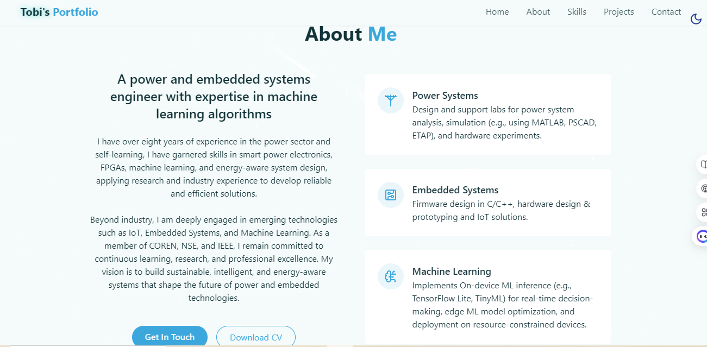
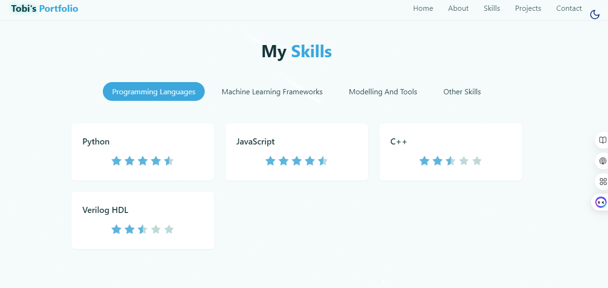
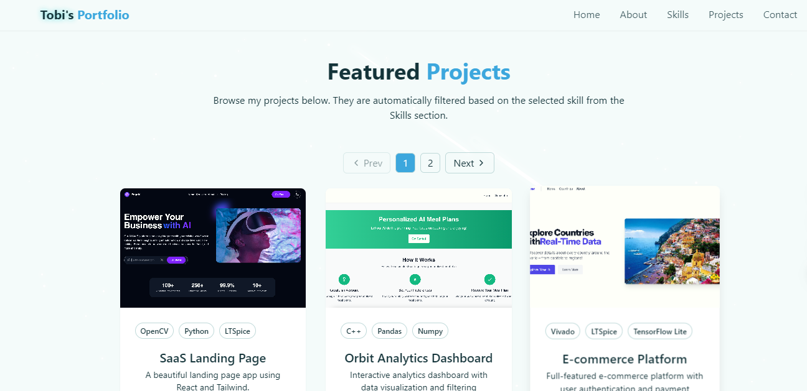
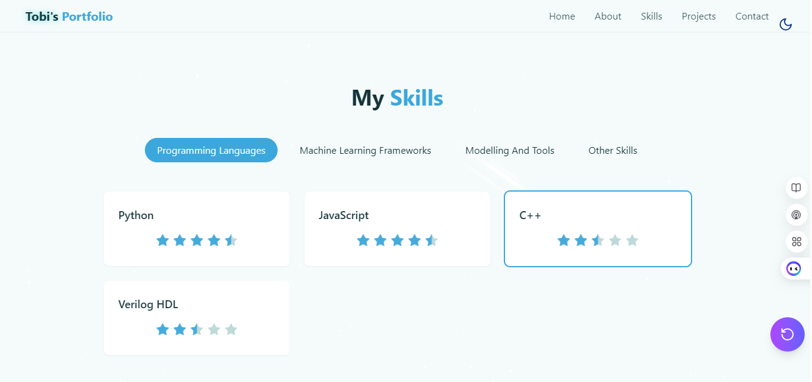
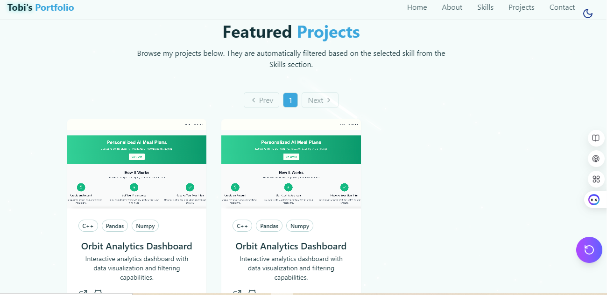
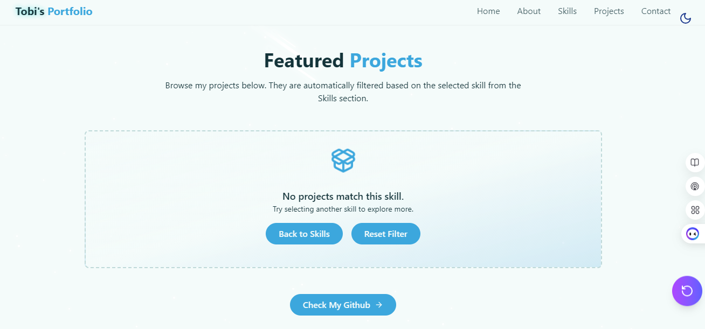

# Tobi's Portfolio Website with React & TailwindCSS
<small>Credits to <a href="https://github.com/machadop1407">Pedro Machado</a> for the repo provided to jumpstart my own portfolio with additonal/improved functionality</small>
<div align="center">
  <br />
    
  </a>
  <br />
  <div>
    
    
    
    
    
    

  </div>
  <br />
</div>

## 📋 Table of Contents

1. [Introduction](#-introduction)
2. [Tech Stack](#-tech-stack)
3. [Features](#-features)
4. [Quick Start](#-quick-start)
5. [Screenshots](#-screenshots)
6. [Deployment](#-deployment)
7. [Useful Links](#-useful-links)

---

## 🚀 Introduction

A modern portfolio website using **React**, **TailwindCSS**, **Vite**, and **Lucide Icons**. From dark mode support to responsive animations, pagination, intereactive projects and skills sections and configured to be fully operational on githubpages

## ⚙️ Tech Stack

* **React** – Component-based UI development
* **Redux Toolkit** - Simplified and efficient state management for React
* **Vite** – Lightning-fast build tool
* **TailwindCSS** – Utility-first CSS for styling
* **Lucide Icons** – Clean and beautiful icon pack
* **Radix UI** – Accessible component primitives
* **GitHub & Gh-Pages** – Deployment

---

## ✨ Features

* 🌓 **Light/Dark Mode Toggle**
  Save theme preference in local storage with beautiful transitions

* 💫 **Animated Backgrounds**
  Stars, meteors, scroll effects, and glowing UI elements

* 📱 **Responsive Navigation**
  Desktop and mobile menus with glassmorphism

* 👨‍💻 **Hero & About Sections**
  Showcase who you are with smooth intro animations and buttons

* 📊 **Skills Grid**
  Filterable star ratings and categories with animated width

* 🖼️ **Paginated Projects Showcase**
  Display screenshots, tech stacks, and GitHub/demo links

* 🎯 **Skill-Based Project Filtering**
  Select a skill to dynamically filter related projects

* 📩 **Contact Section**
  Social icons + responsive and functional contact form using EmailJS with toast notifications

* ⚙️ **One-Click Deployment**
  Easily deploy site on github page using workflow.yml

---

## 👌 Quick Start

### Prerequisites

* [Node.js](https://nodejs.org/)
* [Git](https://git-scm.com/)

### Clone and Run

```bash
git clone https://github.com/yourusername/portfolio.git
cd portfolio
npm install
npm run dev
```

Your app will be available at: [http://localhost:5173](http://localhost:5173)

---

## 📸🖼️ Screenshots

<table>
  <tr>
    <td></td>
    <td></td>
  </tr>
  <tr>
    <td></td>
    <td></td>
  </tr>
  <tr>
    <td></td>
    <td></td>
  </tr>
</table>


---

## ☁️ Deployment

### Deploy on githubpage

✅ 1. Set the homepage in package.json
`
"homepage": "https://<your-username>.github.io/<your-repo-name>"
`
<i>Replace <b>your-username</b> and <b>your-repo-name</b> with your actual GitHub username and repository name. </i>

✅ 2. Push your code to GitHub

Make sure your latest code is pushed to the main (or master) branch of your GitHub repository.

✅ 3. Create GitHub Actions workflow

Automatically build and deploy to your github-page when you push commits to the main branch.
Create a new file at `.github/workflows/workflow.yml` in your project directory, or ensure the one in this repo is present on the same path
`

✅ 4. Configure your router 
```jsx
<BrowserRouter basename="/<your-repo-name>">
```
✅ 5. Enable GitHub Pages
- Go to your repository on GitHub
- Click Settings > Pages
- Under Build and deployment:
- Source: Deploy from a branch
- Branch: gh-pages
- Folder: / (root)
- Click Save

✅ 6. Enable Form to send mail messages
- Go to [EmailJS.com](https://www.emailjs.com/)
- Create an account for email services and obtain your `service_id`, `template_id` and `public_key`
- The credentials should be stored safely in `.env` within your project root and also added to your `repository secrets` under `actions` in `Secrets and Variables` setting. Your `.env` should look like:
```js
VITE_EMAILJS_SERVICE_ID=your_service_id
VITE_EMAILJS_TEMPLATE_ID=your_template_id
VITE_EMAILJS_USER_ID=your_public_key
```
- For more on setting up your EmailJS dashbaord, visit: [EmailJS Doc](https://www.emailjs.com/docs/tutorial/overview/)

✅7. Done 🎉
Your site will automatically be built and deployed to gh-page every time you push changes to the main branch. It will be live at:
`https://<your-username>.github.io/<your-repo-name>`

---

## 🔗 Useful Links

* [React Documentation](https://reactjs.org/)
* [Tailwind CSS Docs](https://tailwindcss.com/)
* [Lucide Icons](https://lucide.dev/)
* [Redux](https://redux.js.org/tutorials/quick-start)
* [Vite](https://vitejs.dev/)
* [EmailJS](https://www.emailjs.com/)

---
